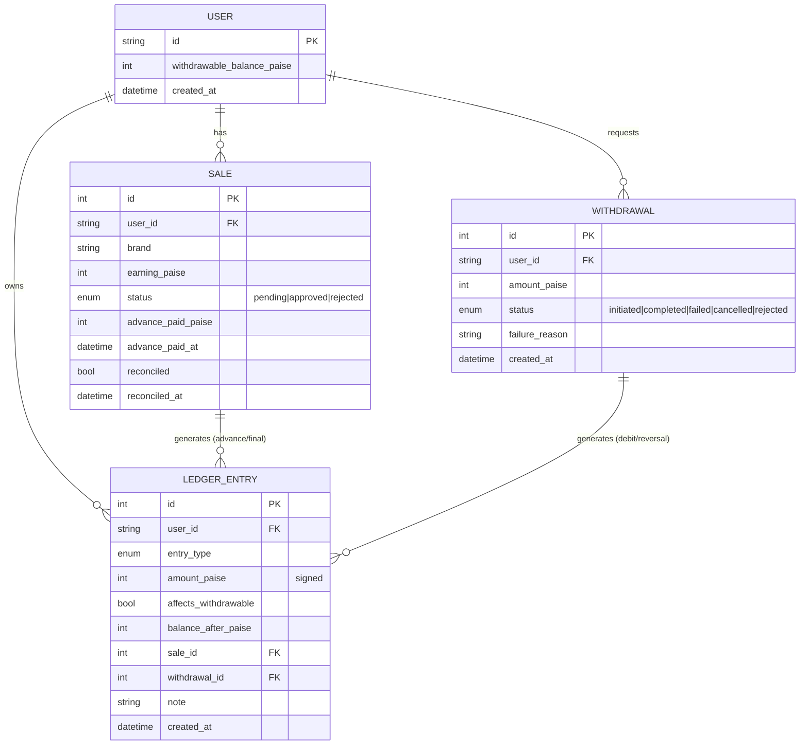

# User Payout Management System — Low-Level Design

A system that manages payouts to affiliate users: it pays a **10% advance** on
pending sales, **reconciles** sales to approved/rejected and settles the final
payout, enforces a **one-withdrawal-per-24h** rule, and **recovers failed
payouts** by crediting them back.

- **Language / stack:** Python 3.13, FastAPI, SQLAlchemy 2.0, SQLite, pytest.
- **Run:** `uv run python seed.py` (worked example) · `uv run main.py` (API) · `uv run pytest` (tests).

---

## 1. Core design decisions

### 1.1 A double-entry-style ledger is the source of truth
Every movement of money is an **immutable, append-only `LedgerEntry`** row with a
signed amount and a typed reason. A user's balance is *derived* from the ledger.
For speed we also keep a **materialized** `User.withdrawable_balance_paise` that is
updated in the same transaction as each ledger write (via `services/ledger.py`),
so the cache can never drift from the ledger.

**Why:** payouts are money. A ledger gives a complete audit trail, makes every
balance explainable, and lets us reconstruct or verify state at any time. It is
also the natural place to enforce idempotency (see 1.3).

### 1.2 Money is stored as integer **paise**
All amounts are integers (1 rupee = 100 paise). Floats (`0.1 + 0.2 != 0.3`) would
accumulate rounding errors across thousands of operations and corrupt balances.
Rupees appear only at the API boundary for readability.

**Advance rounding:** the 10% advance is **floored** to whole paise. The advance
is paid before a sale is confirmed, so rounding *down* is conservative (never
over-advance). Any lost fraction (≤ 0.9 paise) is recovered at settlement, since
approval pays back `earning − advance`.

### 1.3 Idempotency is enforced at the database, not just in code
- **Advance payout** must never pay a sale twice even if the job runs repeatedly.
  Two guards: (a) the job query only selects sales with `advance_paid_at IS NULL`;
  (b) a `UNIQUE(sale_id, entry_type)` constraint on the ledger makes a second
  `ADVANCE` row for the same sale physically impossible.
- **Final settlement** happens once per sale — guarded by the `reconciled` flag
  and the same unique constraint.
- **Failed-payout credit-back** happens once per withdrawal —
  `UNIQUE(withdrawal_id, entry_type)` plus a status check.

Enforcing invariants in the schema means correctness survives races, retries, and
buggy callers — not just the happy path.

### 1.4 The advance is credited to the withdrawable balance on logging
The 10% advance is credited to the user's withdrawable balance the moment a sale
is logged, so it can be withdrawn immediately (subject to the normal 24h rule).
It is recorded in the ledger with `affects_withdrawable = true`. Final settlement
then tops up or claws back:

- **Approved** adds the remaining `earning − advance`, so the sale nets the
  **full earning**.
- **Rejected** claws the advance back (`−advance`), so the sale nets **zero**
  (and the balance goes negative if the advance was already withdrawn).

> lifetime credited = advances + final settlements = Σ(approved earnings)

The advance and its clawback share the same `sale_id`, so a rejected sale's two
entries (`+advance` then `−advance`) cancel exactly.

---

## 2. Data model / schema

### 2.1 ER diagram



### 2.2 Tables

| Table | Purpose | Key columns / constraints |
|---|---|---|
| `users` | account + cached balance | `id` PK (natural, e.g. `john_doe`), `withdrawable_balance_paise` |
| `sales` | one affiliate sale | `earning_paise`, `status`, `advance_paid_paise`, `reconciled`; index `(user_id, status)` |
| `withdrawals` | a payout request | `amount_paise`, `status`; index `(user_id, created_at)` |
| `ledger_entries` | append-only money log | signed `amount_paise`, `affects_withdrawable`, `balance_after_paise`; `UNIQUE(sale_id, entry_type)`, `UNIQUE(withdrawal_id, entry_type)` |

### 2.3 Ledger entry types

| `entry_type` | Sign | Affects withdrawable? | When |
|---|---|---|---|
| `ADVANCE` | + | Yes | sale logged → 10% credited |
| `FINAL_APPROVED` | + | Yes | sale approved → `earning − advance` |
| `FINAL_CLAWBACK` | − | Yes | sale rejected → `−advance` |
| `WITHDRAWAL` | − | Yes | user initiates withdrawal |
| `WITHDRAWAL_REVERSAL` | + | Yes | failed/cancelled/rejected payout credited back |

**Indexes:** `(user_id, status)` on sales speeds the advance-job scan;
`(user_id, created_at)` on withdrawals speeds the 24h lookup; `user_id` on the
ledger speeds balance/audit queries.

---

## 3. Class / module design

```
app/
├── db.py                     Engine, session factory, Base (SQLite FK pragma)
├── models.py                 ORM models + enums (schema)
├── schemas.py                Pydantic request/response DTOs (rupees at boundary)
├── money.py                  paise<->rupee, advance rounding policy
├── clock.py                  injectable UTC "now" (testable time)
├── errors.py                 DomainError hierarchy -> HTTP status codes
├── services/
│   ├── ledger.py             post_entry(): the single balance-mutation point
│   ├── payout_service.py     run_advance_payout(), reconcile_sale()
│   └── withdrawal_service.py initiate/complete/fail withdrawal
├── api/                      FastAPI routers (thin; delegate to services)
│   ├── sales.py  payouts.py  withdrawals.py  users.py
└── main.py                   app wiring + DomainError -> JSON handler
```

**Separation of concerns:** routers do I/O only; **all business rules live in the
service layer** so they are unit-testable without HTTP and reusable from jobs/CLI.
`post_entry` is the *only* function that mutates a balance, which keeps the ledger
and the cached balance in lock-step.

### Key operations (pseudocode)

```
run_advance_payout(user?):
    for sale in sales where status=pending and advance_paid_at is null (and user?):
        advance = floor(earning_paise * 10 / 100)
        sale.advance_paid_paise = advance; sale.advance_paid_at = now
        post_entry(ADVANCE, +advance, affects_withdrawable=True, sale)

reconcile_sale(sale, status):
    assert status in {approved, rejected}
    assert not sale.reconciled                    # settle once
    sale.status = status; sale.reconciled = True
    if approved: post_entry(FINAL_APPROVED, +(earning - advance_paid), affects=True)
    else:        post_entry(FINAL_CLAWBACK, -(advance_paid),          affects=True)

initiate_withdrawal(user, amount):
    last = most recent withdrawal in {initiated, completed}
    if last and now - last < 24h: raise WithdrawalTooSoon
    if amount > balance:          raise InsufficientBalance
    create Withdrawal(initiated); post_entry(WITHDRAWAL, -amount, affects=True)

fail_withdrawal(w, status in {failed,cancelled,rejected}):
    if w already reversed: return           # idempotent
    if w completed: raise                    # funds already left
    w.status = status; post_entry(WITHDRAWAL_REVERSAL, +amount, affects=True)
```

---

## 4. API / endpoints

| Method | Path | Purpose |
|---|---|---|
| `POST` | `/sales` | Create a sale (starts `pending`) |
| `POST` | `/jobs/advance-payout?user_id=` | Run the 10% advance job (idempotent) |
| `POST` | `/reconcile` | Reconcile one or more sales; settles final payout |
| `POST` | `/withdrawals` | Initiate a withdrawal (24h rule + balance check) |
| `POST` | `/withdrawals/{id}/complete` | Confirm the transfer succeeded |
| `POST` | `/withdrawals/{id}/fail` | Mark failed/cancelled/rejected → credit back (Q2) |
| `GET` | `/users/{id}/balance` | Withdrawable balance + full ledger (audit) |
| `GET` | `/health` | Liveness |

Interactive docs at `/docs` when the server runs.

---

## 5. Edge cases & failure handling

| Scenario | Handling |
|---|---|
| Advance job runs many times | Query filter + `UNIQUE(sale_id, ADVANCE)` → each sale advanced once |
| Advance on non-pending sale | Skipped by the query (`status = pending` only) |
| Sub-10-paise earning | Floored advance is 0 → no entry created |
| Reconciling a sale twice | `reconciled` flag → `AlreadyReconciledError` (409) |
| Invalid reconcile status (e.g. `pending`) | `InvalidStatusError` (400) |
| Approved with no advance paid | Pays full earning (`advance_paid = 0`) |
| Rejected with no advance paid | Adjustment 0, no ledger row |
| Withdrawal within 24h | `WithdrawalTooSoonError` (429) with next-allowed time |
| Withdrawal > balance / ≤ 0 | `InsufficientBalanceError` (422) |
| **Negative balance from clawbacks** | Allowed to go negative; carried as debt. Withdrawals are blocked until future approvals bring it positive |
| Failed payout webhook fires twice | `UNIQUE(withdrawal_id, REVERSAL)` + status check → credited back once |
| Failing an already-completed withdrawal | Rejected (`InvalidWithdrawalStateError`, 409) — funds already left |
| Re-withdraw after a failure | Failed withdrawals don't count toward the 24h rule → allowed immediately (Q2) |

---

## 6. Trade-offs & what I'd change for production

- **SQLite + `create_all`** keeps the assignment zero-config. Production →
  PostgreSQL + Alembic migrations; the code is DB-agnostic (URL swap).
- **Materialized balance vs. pure ledger sum.** I keep both: O(1) reads with a
  ledger to reconcile against. Trade-off: the cache must be updated in the same
  transaction (it is, via `post_entry`).
- **Concurrency.** SQLite serializes writers, so the demo is safe. On Postgres
  the 24h check + balance debit should run under `SELECT … FOR UPDATE` on the
  user row (or a transactional balance check) to prevent two simultaneous
  withdrawals from both passing. The unique constraints already protect the
  advance/settlement/reversal paths regardless of locking.
- **Advance job scale.** Shown as a synchronous endpoint. In production it would
  be a scheduled/queued batch job processing sales in pages; the idempotent
  design means partial failures are simply retried.
- **External transfers.** `initiated → completed/failed` models the async payment
  provider; the provider's webhook would drive `complete`/`fail`. Money is
  reserved (debited) on `initiate` and only returned on failure.
- **Rounding policy** (floor) is a documented, conservative choice; the exact
  rule is a business decision and is isolated in `money.advance_of`.
```
